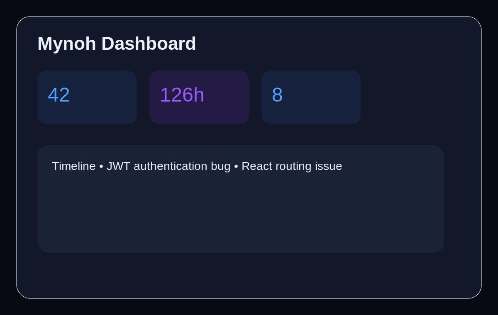

# Mynoh

Mynoh is a cross-platform desktop memory assistant for software engineers. It captures bugs, debugging sessions, solutions, coding decisions, screenshots, snippets and lessons learned so previous solutions are instantly searchable.



## Highlights

- One Python 3.13+ codebase for Windows, macOS and Linux
- Flet desktop UI with glassmorphism dark mode
- SQLite by default with repository abstraction for PostgreSQL/MySQL migration
- GitHub settings and polling-ready push monitor
- Full-text and natural-language style search
- Timeline, dashboard, rich capture form, exports and backups
- Secure token storage using OS keyring with encrypted fallback
- GitHub Actions for lint, test, build and release artifacts

## Quick Start

```bash
python3.13 -m venv .venv
source .venv/bin/activate  # Windows: .venv\Scripts\activate
pip install -e '.[dev]'
python scripts/init_db.py
python main.py
```

## Project Structure

```text
ui/          Flet interface, floating assistant and components
services/    Application use cases: capture, search, monitor, export, backup
database/    SQLite schema, connection and repositories
models/      Domain entities
github/      GitHub API client and local repository detector
settings/    Runtime config
utils/       Logging and security helpers
assets/      Icons and demo assets
tests/       Unit/integration tests
docs/        User, developer and architecture docs
scripts/     Build, database and startup scripts
```

## Distribution

Run `python scripts/build.py` locally or use GitHub Actions. Workflows produce portable artifacts; extend with platform-native tools such as WiX, appimagetool, fpm and create-dmg for MSI/AppImage/DEB/RPM/DMG/PKG packaging.

## Security

GitHub tokens are stored in the platform keychain where available. If no keychain backend exists, Mynoh writes encrypted fallback secret files outside the database.
