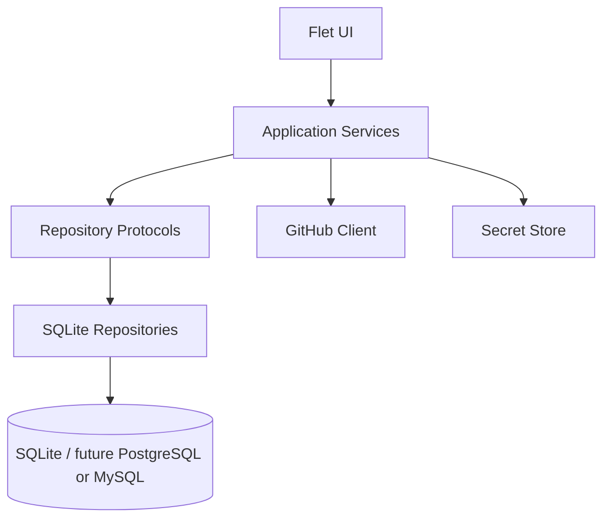

# Architecture

```mermaid
flowchart TD
  UI[Flet UI] --> Services[Application Services]
  Services --> RepoProtocols[Repository Protocols]
  RepoProtocols --> SQLite[SQLite Repositories]
  Services --> GitHub[GitHub Client]
  Services --> Security[Secret Store]
  SQLite --> DB[(SQLite / future PostgreSQL or MySQL)]
```

Principles: SOLID, dependency injection, explicit boundaries, type hints, logging and testable use cases.
